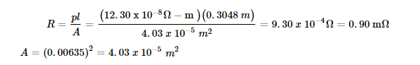
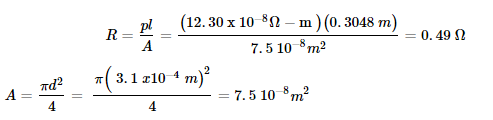
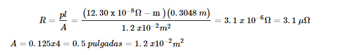
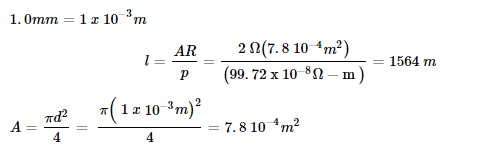
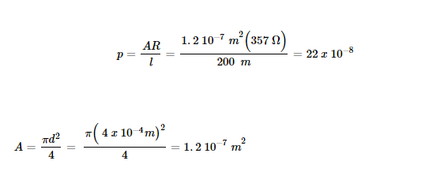
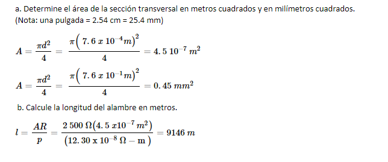
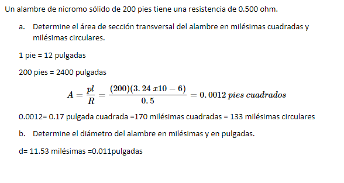

# Informe_Tarea_2

Integrantes: Chachalo Mayerli, Mensias Adrian, Robalino Johanna, Vallejo Keily 

## 1. OBJETIVOS 

## 2. MARCO TEÓRICO 

### Capitulo 3 

### Capitulo 4 

## 3. EXPLICACIÓN Y RESOLUCIÓN DE EJERCICIOS O PROBLEMAS

  ### EJERCICIOS CAPITULO 3
  
  ### **EJERCICIOS IMPARES**
  
  **3.1 Resistencia de conductores** 
  
  1. Determine la resistencia a 20°C, de 100 m de alambre de aluminio solido que tien los siguientes radios.
 
 a. 0.5mm

 
 
 b. 1.0 mm
  
  

c. 0.005 mm

d. 0.5 cm 

2.- Determine la resistencia, a 20ºC, de 200 pies de conductores de hierro que tienen las siguientes secciones transversales: 

a. Cuadrada de 0.25 x 0.25 pulgadas  

b. Redonda de 0.125 pulgadas de diámetro

c. Rectangular de 0.125 x 4.0 pulgadas

 
 

3. Una barra coletora de cobre sólido de 250 pies de longitud, que se muestra n la figura 3-34, se usa para conectar una fente de voltaje a un panel de distribución, Si la barra tiene una resistencia de 0.02 Ω a 20°C, calcule la altura requerida de la barra (en pulgdas).

4. El alambre de nicromo se usa para construir elementos calefactores. Determine la longitud de un alambre de nicromo de 1.0 mm de diámetro que se necesita para producir un elemento calefactor que tenga una resistencia de 2.0 ohm a una temperatura de 20°C. 

5. Un alambre de cobre con un diámetro de 0.80 mm tiene una resistencia de 10.3 a 20°C. ¿Cuanto mide el alambre en metros y en pies?

6. Una pieza de alambre de aluminio tiene una resistencia, a 20°C, de 20 Ω. Si este alambre se funde y se usa para producir un segundo alambre que tiene una longitud cuatro veces más grande que la original, ¿cuál será la resistencia del nuevo alambre a 20°C? (Sugerencia: el volumen del alambre no ha cambiado.) 

7. Determine la resistividad (en ohm-metros) de un cilindro de grafito con basede carbón que tiene una longitud de 6.00 cm, un diámetro de 0.50 mm y una resistencia medida de 3.0  a 20°C. ¿Cómo se compara este valor con la re-sistividad que se reporta para el carbón?

8. Un alambre sólido circular de 200 m de longitud y con un diámetro de 0.4 mm tiene una resistencia de 357 Ω a 20°C. ¿De qué material está hecho el alambre? 

9. Una sección de 2 500 m de alambre de aleación tiene una resistencia de 32.Si el alambre tiene un diámetro de 1.5 mm, determine la resistividad del ma-terial en ohm-metros. ¿La aleación es mejor conductora que el cobre?

10.  Una sección de alambre de hierro con un diámetro de 0.030 pulgadas tiene una resistencia de 2 500 Ω (a una temperatura de 20°C). 

**3.2 Tabla de alambre eléctricos**

11. Utilice la tabla 3-2 para determinar la resistencia de 300 pies de conductoresde cobre sólido AWG 22 y AWG 19. Compare los diámetros y resistencias delos alambres.

12. Use la tabla 3-2 para encontrar la resistencia de 250 m de conductores de cobre sólido AWG 8 y AWG 2. Compare los diámetros y resistencias de los alambres. 

AWG 8: Diámetro de 0.1285 pulgadas. Resistencia 0.6281  

AWG 2: Diámetro de 0.2575 pulgadas. Resistencia 0.1563  

13. Determine la máxima corriente que puede conducir un alambre AWG 19 yuno AWG 30. 

El alambre de cobre AWG 19 es capaz de soportar 4 A ,por lo tanto el alambre AWG 30 es menor y será capaz de soportar la onceava parte del amperaje

14. Si el AWG 8 se especifica para un máximo de 40 A, ¿cuánta corriente podrá conducir con seguridad el AWG 2? 

Ya que el alambre AWG 8 es 6 veces menor que AWG 2, el cable de diámetro menor será capaz de conducir cerca de una sexto de la capacidad del cable de diámetro mas grande.  

AWG 8: Será capaz de conducir 6.6 A de corriente. 

AWG 2: Será capaz de conducir 40 A   

15. e determina que un carrete de alambre de transformador de cobre AWG 36tiene una resistencia de 550 a una temperatura de 20°C. ¿Cuánto mide elalambre en metros?

16. ¿Cuánta corriente será capaz de conducir un alambre de cobre AWG 36? 

La capacidad de corriente se duplica por cada incremento de tres calibres, y se reduce de igual forma, el AWG 36 será capaz de conducir 2 A.  

**Resistencia de alambres: milesima circular** 

17. Determin el área en milésimas circulares de los siguients conductores (T= 20°C)

a. Alambre con un diámetro de 0.016 pulgadas.

b. Alambre circulr con un diámetro de 2.0 mm.

c. Barra colectora regulr de 0.25 x 6.0 pulgadas.

18. Exprese las áreas de las secciones transversales de los conductores del problema 17 en milésimas y milímetros cuadrados. 

a. 265 MC = 208 milésimas cuadradas = 134 .19 milímetros cuadrados. 

b. 6200 MC = 4869 milésimas cuadradas = 3141.3 milímetros cuadrados. 

c. 1910 MC = 1500 milésimas cuadradas = 967.7 milímetros cuadrados. 

19. Calcule la resistencia, a 20°C, de 400 pies de conductores de cobre que tienelas mismas áreas de sección transversal que las del problema 17.

a.

b. 

c. 

20. Determine el diámetro en pulgadas y en milímetros de cables circulares que tiene las siguientes áreas se secciones transversales (suponga que los cables son conductores sólidos): 

a. 250 MC = 15.8 milésimas = 0.0158 pulgadas = 0.40132 milímetros  

b. 1000 MC = 31. 63 milésimas = 0.0316 pulgadas= 0.80264 milímetros 

c. 250 MMC = 250 000 MC = 500 milésimas = 0.5 pulgadas= 12.7 milímetros 

d. 750 MMC = 750 000 MC= 866 milésimas= 0.866 pulgadas= 21.9 milímetros 

21. Un alambre de cobre sólido de 200 pies tiene una resistencia de 0.500Ω.

a.  Determine el área de sección transversal del alambre en milésimas cuadra-das y milésimas circulares. 

b.  Determine el diámetro del alambre en milésimas y en pulgadas

22. Repita el problema 21 si el alambre está hecho de nicromo. 

23. Un carrete de alambre de cobre sólido con un diámetro de 0.040 pulgadastiene una resistencia de 12.5Ω (a una temperatura de 20°C).

a.  Determine el área de sección transversal en milésimas cuadradas y milési-mas circulares. 

b.  Calcule la longitud del alambre en pies.

**3.4 Efectos de la temperatura**

25. Un conductor de aluminio tiene una resistencia de 50 Ω a temperatura am-biente. Encuentre la resistencia para el mismo conductor a -30°C, 0°C y a200°C.

26. Se diseña un alambre para uso doméstico de cobre sólido AWG 14 para operar dentro de un intervalo de temperatura de -40°C a 90°C. Calcule la resistencia de 200 pies de circuito de alambre a ambas temperaturas. Nota: un pie de circuito es la longitud del cable necesario para que la corriente viaje hacia una carga y de regreso.

27.  Cierto material tiene una resistencia de 20Ω a temperatura ambiente (20°C) y25 Ω a una temperatura de 85°C.

a.  ¿El material tiene un coeficiente de temperatura positivo o negativo? Explique brevemente.

b.  Determine al valor del coeficiente de temperatura,a, a 20°C. 

c.  Suponga que la función de resistencia frente a temperatura es lineal y de-termine la resistencia esperada del material a 0°C (el punto de congelacióndel agua) y a 100°C (el punto de ebullición del agua)

28. Cierto material tiene una resistencia de 100 Ω a temperatura ambiente (20°C) y de 150 Ω a -25°C. a. ¿El material tiene un coeficiente de temperatura positivo o negativo? Explique brevemente. 

Cualquier material para el cual la resistencia aumenta conforme se incrementa la temperatura se dice que tiene un coeficiente de temperatura positivo 
Conforme la temperatura se incrementa, el número de electrones de carga aumenta, lo que resulta en más corriente. 

Por lo tanto, un incremento en la temperatura resulta en una disminución de la resistencia y, en consecuencia, estos materiales tienen coeficientes de temperatura negativos.

b. Determine al valor del coeficiente de temperatura, a, a 20°C. 

29. Un calentador eléctrico está hecho de alambre de nicromo. El alambre tieneuna resistencia de 15.2 Ω a una temperatura de 20°C. Determine la resistenciadel alambre de nicromo cuando su temperatura aumente a 260°C.

30. Un diodo de silicio tiene una resistencia de 500 Ω a 20°C. Determine la resistencia del diodo si su temperatura se incrementa con un cautín a 30° C. (Suponga que la función de resistencia frente a temperatura es lineal.)

31. Un dispositivo eléctrico tiene una respuesta lineal de temperatura. El disposi-tivo tiene una resistencia de 120Ω a una temperatura de -20°C y de 190 Ω a120°C. 

a.  Calcule la resistencia a una temperatura de 0°C.

b.  Calcule la resistencia a una temperatura de 80°C.

c.  Determine la intercepción de temperatura del material

32. Deduzca la expresión de la ecuación 3-8

Para calcular la resistencia de un conductor a diferentes temperaturas

**3.5 Tipos de resistorez**

33. Un resistor variable de 10 kΩ tiene su contacto deslizante (terminal movibleb) inicialmente en la terminal inferior c. Determine la resistencia Rabentre lasterminales ay b, y la resistencia Rbcentre las terminales by cdadas las si-guientes condiciones:

a.  El contacto deslizante esta en c.

b.  El contacto deslizante está a una quinta parte del trayecto de la superficieresistiva. 

c.  El contacto deslizante está a cuatro quintas partes del trayecto de la super-ficie resistiva.

d.  El contacto deslizante está en a.

**3.6 Código de colores de resistores**

34. Se mide la resistencia entre la terminal b del contacto deslizante y la terminal inferior c de un resistor variable de 200 kΩ y da 50 kΩ. Determine la resistencia que se medirá entre la terminal superior a, y la terminal del contacto deslizante b.

35. Dados los resistores con los siguientes códigos de colores (de izquierda a de-recha) determine la resistencia, la tolerancia y la confiabilidad de cada com-ponente. Exprese la incertidumbre en porcentaje y en ohms. 

a.  Café    Verde   Amarillo    Plata

b.  Rojo    Gris    Oro         Oro     Amarillo

c.  Amarillo  Violeta Azul      Oro

d.  Naranja   Blanco  Negro     Oro     Rojo

**3.7 Medicion de resistencia: el óhmetro**

36. Determine los códigos de colores requeridos si necesitara los siguientes resistores para un proyecto: 

37. Explique cómo se puede usar un óhmetro para determinar si un foco se fundió.

Se determina a través de óhmetro realizando una conexión entre las terminales, el óhmetro indica una conexión abierta la bombilla esta fundida.

38. Si un óhmetro fuera colocado entre las terminales de un interruptor, ¿qué resistencia esperaría medir cuando los contactos del interruptor estén cerrados y cuando estén abiertos?

Cuando se actúa sobre un interruptor abierto (NA), el interruptor se cierra, permitiendo la circulación eléctrica a su través, venciendo la fuerza ejercida por el muelle o resorte, y dando lugar al contacto eléctrico entres sus terminales

Cerrado= cortocircuitos

Abierto= circuito abierto 

39. Explique cómo podría usar un óhmetro para determinar aproximadamentecuánto cable queda en un carrete de alambre de cobre AWG 24.

En la tabla se puede observar que la resistencia del alambre AWG24 tiene una resistencia de 25.7 ohms/1000 pies se podría medir la resistencia entre los extremos y calcular la longitud
 
I=R/(0.0257𝑜ℎ𝑚𝑠/𝑓𝑡)

40. Se usa un óhmetro analógico para medir la resistencia de un componente de dos terminales. El óhmetro indica una resistencia de 1.5 kΩ. Cuando se invierten las terminales el medidor indica que la resistencia del componente es un circuito abierto. ¿El componente está defectuoso? Si no, ¿qué tipo de componente se está probando? 

Normalmente el óhmetro se utiliza para indicar cantidades de resistencia, pero también se utiliza para pruebas de continuidad esta prueba determina si existe una conexión eléctrica continua de un punto a otro.

El componente no está defectuoso. Ya que no se debe tomar en cuenta el polo positivo o el negativo, sino que la resistencia trabaja de cualquier manera.

**3.8 Termistores**

41. Un termistor tiene las características que se muestran en la figura 3-23.
 
 

a.  Determine la resistencia del dispositivo a temperatura ambiente, 20°C.

380 Ω

b.  Determine la resistencia del dispositivo a 40°C. 

180 Ω

c.  ¿El  termistor  tiene  un  coeficiente  de  temperatura  positivo  o  negativo?Explique

Coeficiente de temperatura negativo. La resistencia disminuye conforme se incrementa la temperatura.

42. Para la fotocelda que tiene las características que se muestra en la figura 3-24(c), determine la resistencia 

**3.11 Conducctancia** 

43. Calcula las conductancia de las siguientes resistencias

a.  0.25 Ω 

4ms

b.  500 Ω

0.002 ms

c.  250 kΩ 

0.004us

d.  12.5 MΩ

0.08 S

44. Determine la resistencia de los componentes que tienen las siguientes conductancias:

45. Determine la conductancia de una barra colectora de aluminio que mide 200pies (a una temperatura de 20°C) la cual tiene una sección transversal quemide 4.0 pulgadas 0.25 pulgadas. Si la temperatura aumentara, ¿qué pasa-ría con la conductancia de la barra?
 
 
 
 46. Determine la conductancia de una barra colectora de aluminio que mide 200 pies (a una temperatura de 20°C) la cual tiene una sección transversal que mide 4.0 pulgadas x 0.25 pulgadas. Si la temperatura aumentara, ¿qué pasaría con la conductancia de la barra?

### **EJERCICIOS PARES** 

3-1 RESISTENCIA DE CONDUCTORES
2.- Determine la resistencia, a 20ºC, de 200 pies de conductores de hierro que tienen las siguientes secciones transversales:
a. Cuadrada de 0.25 x 0.25 pulgadas 
R=pl/A=((12.30 x 10^(-8) Ω-m )(0.3048 m))/(4.03 x 10^(-5)  m^2 )=9.30 x 10^(-4) Ω=0.90 mΩ
 A=〖(0.00635)〗^2=4.03 x 10^(-5)  m^2
b. Redonda de 0.125 pulgadas de diámetro 
R=pl/A=((12.30 x 10^(-8) Ω-m )(0.3048 m))/(7.5 10^(-8) m^2 )=0.49 Ω
A=(πd^2)/4=  (π( 〖3.1 x10^(-4)  m)〗^2)/4=7.5 10^(-8) m^2
c. Rectangular de 0.125 x 4.0 pulgadas
R=pl/A=((12.30 x 10^(-8) Ω-m )(0.3048 m))/(1.2 x10^(-2) m^2 )=3.1 x 10^(-6) Ω=3.1 μΩ
A=0.125x4=0.5 pulgadas=1.2 x10^(-2) m^2
4. El alambre de nicromo se usa para construir elementos calefactores. Determine la longitud de un alambre de nicromo de 1.0 mm de diámetro que se necesita para producir un elemento calefactor que tenga una resistencia de 2.0 ohm a una temperatura de 20°C.
1.0mm=1 x 10^(-3) m
l=AR/p=(2 Ω(7.8 10^(-4) m^2))/((99.72 x 10^(-8) Ω-m ))=1564 m
A=(πd^2)/4=  (π( 〖1 x 10^(-3) m)〗^2)/4=7.8 10^(-4) m^2
6. Una pieza de alambre de aluminio tiene una resistencia, a 20°C, de 20 Ω. Si este alambre se funde y se usa para producir un segundo alambre que tiene una longitud cuatro veces más grande que la original, ¿cuál será la resistencia del nuevo alambre a 20°C? (Sugerencia: el volumen del alambre no ha cambiado.)
R=pl/A
20=(2.825 x 10^(-4)  )x/((π〖(5.7x10^(-4))〗^2)/4)
x=31.4
La medida del nuevo alambre es : 125.66
8. Un alambre sólido circular de 200 m de longitud y con un diámetro de 0.4 mm tiene una resistencia de 357 Ω  a 20°C. ¿De qué material está hecho el alambre?
Está hecho de PLOMO
p=AR/l=(1.2 〖10^(-7)  m〗^2 (357 Ω))/(200  m)=22 x 10^(-8)
A=(πd^2)/4=  (π( 〖4 x 10^(-4) m)〗^2)/4=1.2 〖10^(-7)  m〗^2
10.  Una sección de alambre de hierro con un diámetro de 0.030 pulgadas tiene una resistencia de 2 500 Ω (a una temperatura de 20°C).
a. Determine el área de la sección transversal en metros cuadrados y en milímetros cuadrados. (Nota: una pulgada = 2.54 cm = 25.4 mm)
A=(πd^2)/4=  (π( 〖7.6 x 10^(-4) m)〗^2)/4=4.5 10^(-7 ) m^2  
A=(πd^2)/4=  (π( 〖7.6 x 10^(-1) m)〗^2)/4=0.45 〖mm〗^2
 b. Calcule la longitud del alambre en metros.
l=AR/p=(2 500 Ω(4.5 〖x10〗^(-7 ) m^2))/((12.30 x 10^(-8 ) Ω-m ))=9146 m

3-2 TABLA DE ALAMBRES ELÉCTRICO
12. Use la tabla 3-2 para encontrar la resistencia de 250 m de conductores de cobre sólido AWG 8 y AWG 2. Compare los diámetros y resistencias de los alambres.
AWG 8: Diámetro de 0.1285 pulgadas. Resistencia 0.6281 
AWG 2: Diámetro de 0.2575 pulgadas. Resistencia 0.1563 
14. Si el AWG 8 se especifica para un máximo de 40 A, ¿cuánta corriente podrá conducir con seguridad el AWG 2?
Ya que el alambre AWG 8 es 6 veces menor que AWG 2, el cable de diámetro menor será capaz de conducir cerca de una sexto de la capacidad del cable de diámetro mas grande. 
AWG 8: Será capaz de conducir 6.6 A de corriente.
AWG 2: Será capaz de conducir 40 A  
16. ¿Cuánta corriente será capaz de conducir un alambre de cobre AWG 36?
La capacidad de corriente se duplica por cada incremento de tres calibres, y se reduce de igual forma, el AWG 36 será capaz de conducir 2 A. 
3-3 RESISTENCIA DE ALAMBRES: MILÉSIMA CIRCULAR
18. Exprese las áreas de las secciones transversales de los conductores del problema 17 en milésimas y milímetros cuadrados.
1 milésima cuadrada =4/π MC
	265 MC = 208 milésimas cuadradas = 134 .19 milímetros cuadrados.
	6200 MC = 4869 milésimas cuadradas = 3141.3 milímetros cuadrados.
	1910 MC = 1500 milésimas cuadradas = 967.7 milímetros cuadrados.

20. Determine el diámetro en pulgadas y en milímetros de cables circulares que tiene las siguientes áreas se secciones transversales (suponga que los cables son conductores sólidos):
a. 250 MC = 15.8 milésimas = 0.0158 pulgadas = 0.40132 milímetros 
b. 1000 MC = 31. 63 milésimas = 0.0316 pulgadas= 0.80264 milímetros
c. 250 MMC = 250 000 MC = 500 milésimas = 0.5 pulgadas= 12.7 milímetros
d. 750 MMC = 750 000 MC= 866 milésimas= 0.866 pulgadas= 21.9 milímetros

22. Repita el problema 21 si el alambre está hecho de nicromo.
Un alambre de nicromo sólido de 200 pies tiene una resistencia de 0.500 ohm. 
	Determine el área de sección transversal del alambre en milésimas cuadradas y milésimas circulares. 
1 pie = 12 pulgadas 
200 pies = 2400 pulgadas 
A=pl/R=((200)(3.24 x10-6))/0.5=0.0012 pies cuadrados
0.0012= 0.17 pulgada cuadrada =170 milésimas cuadradas = 133 milésimas circulares 
	Determine el diámetro del alambre en milésimas y en pulgadas.
d= 11.53 milésimas =0.011pulgadas 

26. Se diseña un alambre para uso doméstico de cobre sólido AWG 14 para operar dentro de un intervalo de temperatura de -40°C a 90°C. Calcule la resistencia de 200 pies de circuito de alambre a ambas temperaturas. Nota: un pie de circuito es la longitud del cable necesario para que la corriente viaje hacia una carga y de regreso.
AWG 14= 2.525
R-40°C =(-40 °C-(-234 °C ))/(20 °C-(-234 °C ) )*2.525=1.9285Ω 
R90 °C=(90°C-(-234°C ))/(20°C-(-234°C ))*2.525=3.2208Ω
28. Cierto material tiene una resistencia de 100 Ω a temperatura ambiente (20°C) y de 150 Ω a -25°C. a. ¿El material tiene un coeficiente de temperatura positivo o negativo? Explique brevemente. 
Cualquier material para el cual la resistencia aumenta conforme se incrementa la temperatura se dice que tiene un coeficiente de temperatura positivo 
Conforme la temperatura se incrementa, el número de electrones de carga aumenta, lo que resulta en más corriente. Por lo tanto, un incremento en la temperatura resulta en una disminución de la resistencia y, en consecuencia, estos materiales tienen coeficientes de temperatura negativos.
b. Determine al valor del coeficiente de temperatura, a, a 20°C. 
T2=(T1-T)R2/R1+T
T2=(20°C-(-25°C))(100Ω)/150Ω+(-25°C)
T2=11.66 °C

30. Un diodo de silicio tiene una resistencia de 500 Ω a 20°C. Determine la resistencia del diodo si su temperatura se incrementa con un cautín a 30° C. (Suponga que la función de resistencia frente a temperatura es lineal.)

32. Deduzca la expresión de la ecuación 3-8
 
Para calcular la resistencia de un conductor a diferentes temperaturas
α20=1/(T1+20°C)

Definido como el coeficiente de temperatura de resistencia a una temperatura de 20 °C y R20 determinaremos la resistencia R1 a una temperatura T1 según
R1=R20(1+α20(T1-20°C))
Esta ecuación puede escribirse como:
α20=((R1-R20)/(T1-20°C))/R20=(ΔR/ΔT)/R20
Podemos concluir que cuando mas alto es el coeficiente de temperatura de la resistencia de un material, más sensible es el nivel de la resistencia a los cambios de temperatura.
34. Se mide la resistencia entre la terminal b del contacto deslizante y la terminal inferior c de un resistor variable de 200 kΩ y da 50 kΩ. Determine la resistencia que se medirá entre la terminal superior a, y la terminal del contacto deslizante b.
Rac=Rab+Rbc
50 kΩ-250kΩ=-150kΩ
50 kΩ=200kΩ-150kΩ
36. Determine los códigos de colores requeridos si necesitara los siguientes resistores para un proyecto: 
a. 33 kΩ ± 5%, 0.1% de confiabilidad
Naranja-Naranja-Negro-Oro-Rojo
 b. 820 Ω ± 10% 
Gris-Rojo-Café-Plata
c. 15 Ω ± 20% 
Café-Verde-Negro-Sin color
d. 2.7 MΩ ± 5 %
Rojo-Violeta-Violeta-Oro

38. Si un óhmetro fuera colocado entre las terminales de un interruptor, ¿qué resistencia esperaría medir cuando los contactos del interruptor estén cerrados y cuando estén abiertos?
Cuando se actúa sobre un interruptor abierto (NA), el interruptor se cierra, permitiendo la circulación eléctrica a su través, venciendo la fuerza ejercida por el muelle o resorte, y dando lugar al contacto eléctrico entres sus terminales
Cerrado= cortocircuitos
Abierto= circuito abierto 
40. Se usa un óhmetro analógico para medir la resistencia de un componente de dos terminales. El óhmetro indica una resistencia de 1.5 kΩ. Cuando se invierten las terminales el medidor indica que la resistencia del componente es un circuito abierto. ¿El componente está defectuoso? Si no, ¿qué tipo de componente se está probando? 
Normalmente el óhmetro se utiliza para indicar cantidades de resistencia, pero también se utiliza para pruebas de continuidad esta prueba determina si existe una conexión eléctrica continua de un punto a otro.
El componente no está defectuoso. Ya que no se debe tomar en cuenta el polo positivo o el negativo, sino que la resistencia trabaja de cualquier manera.
42. Para la fotocelda que tiene las características que se muestra en la figura 3-24(c), determine la resistencia 
 
	en un sótano con iluminación atenuada de 10 lux 
       R= 20kΩ
	en una casa con una iluminación de 50 lux 
R=5.02kΩ
	en un salón de clases con una iluminación de 500 lux
R=550 Ω

44. Determine la resistencia de los componentes que tienen las siguientes conductancias:
G=1/R(siemens,SI)
 a. 62.5 uS 
R=1/62.5=0.016 kΩ
b. 2 500 mS 
R=1/2500=4x10^(-4) Ω
	5.75 mS 
R=1/5.75=0.17Ω
d. 25.0 S
R=1/25.0=0.04 mΩ
46. Determine la conductancia de una barra colectora de aluminio que mide 200 pies (a una temperatura de 20°C) la cual tiene una sección transversal que mide 4.0 pulgadas x 0.25 pulgadas. Si la temperatura aumentara, ¿qué pasaría con la conductancia de la barra?
Seccion transversal A=4*0.25 pulgadas=1 pulgada
R=pl/A=(2.825x10^(-8)*200)/1=5.65x10^(-6)  Ω
G=1/R
G=1/(5.65x10^(-6) )=176991.1 S

 
 ### EJERCICIOS CAPITULO 4

## 4. VIDEO 

## 5. CONCLUCIONES 

 - De acuerdo con los objetivos planteados y a la resolución de los ejercicios del capítulo 3 podemos decir que la corriente que pasa por un alambre se la puede predecir conociendo su calibre. Para expresar el área transversal de diámetros muy pequeños se puede hacer la conversión en milésimas cuadradas y circulares. 
 - 

## 6. BIBLIOGRAFÍA
